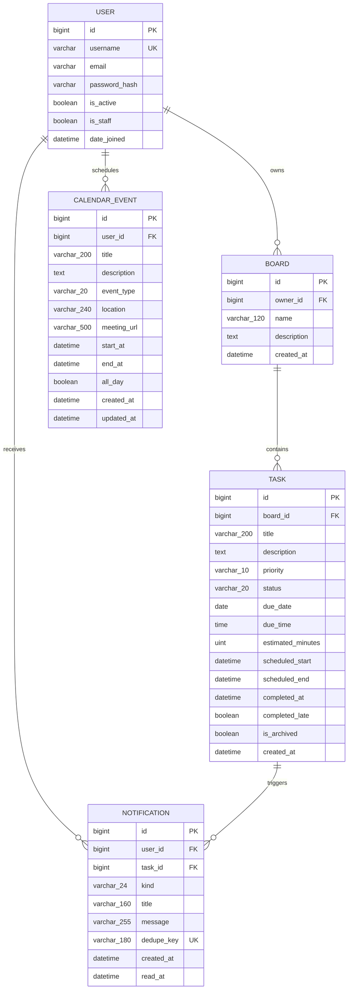
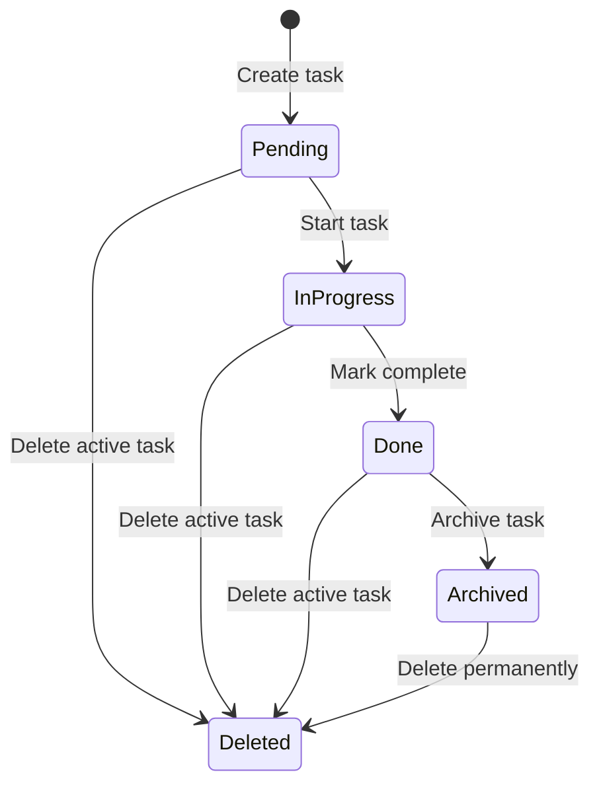
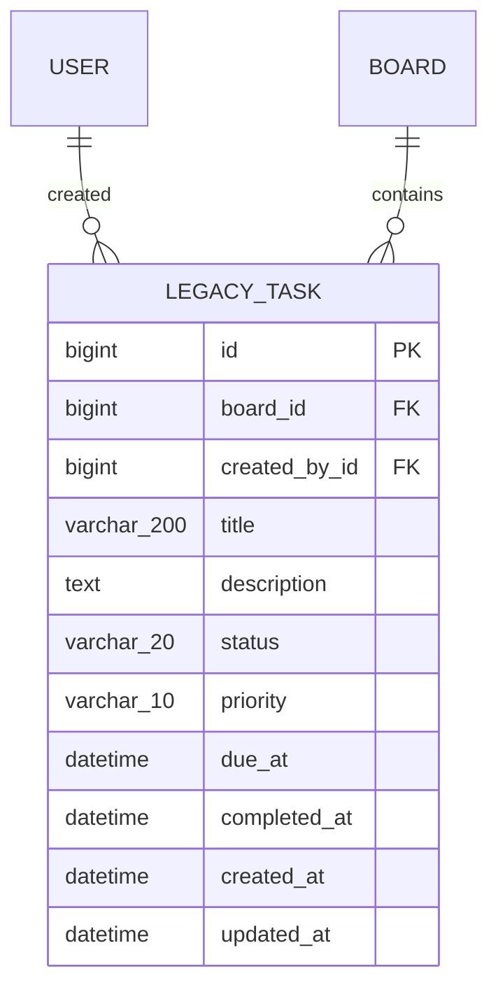

# Task Master: Entity–Relationship Diagram and Business Rules

## 1. Scope

This document describes the relational data model used by the Task Master Django
application. The operational model uses Django's built-in `User`, `boards.Board`,
`boards.Task`, `planner.CalendarEvent`, and `notifications.Notification` models.

Django framework tables for permissions, groups, sessions, migrations, and admin
logs are intentionally omitted because they support the framework rather than the
Task Master business domain.

## 2. Operational ERD

### Relationship summary

| Parent | Child | Cardinality | Required child reference | Delete behavior |
|---|---|---:|---|---|
| User | Board | 1 to 0..many | `Board.owner_id` | Deleting the user deletes the boards |
| Board | Task | 1 to 0..many | `Task.board_id` | Deleting the board deletes its tasks |
| User | CalendarEvent | 1 to 0..many | `CalendarEvent.user_id` | Deleting the user deletes the events |
| User | Notification | 1 to 0..many | `Notification.user_id` | Deleting the user deletes the notifications |
| Task | Notification | 1 to 0..many | `Notification.task_id` | Deleting the task deletes its notifications |

All five foreign keys use `ON DELETE CASCADE`.

## 3. Entity definitions

### User

The authenticated workspace owner. Django stores passwords as hashes. A user owns
boards and personal calendar events and receives deadline notifications.

### Board

A project workspace belonging to exactly one user. A board groups its owner's
tasks and provides the security boundary used when reading or changing tasks.

### Task

A unit of work belonging to exactly one board. A task has a workflow status,
priority, deadline, estimated effort, optional Planner work block, completion
metadata, and archive state.

### CalendarEvent

A personal Planner commitment belonging directly to a user. Events can represent
meetings, focus sessions, classes, appointments, personal commitments, or another
type.

### Notification

A generated deadline alert for one user and one task. `read_at = NULL` means the
notification is unread. Its unique deduplication key prevents repeated alerts for
the same user, task, alert kind, and deadline.

## 4. Business rules

### 4.1 Accounts and access control

1. A visitor must register or sign in before accessing dashboards, boards, tasks,
   the Planner, archives, or notifications.
2. A username must be unique under Django's authentication rules.
3. Registration requires an email address, and the application rejects another
   account using the same email address without regard to letter case.
4. A signed-in user may only read or change boards that they own.
5. Task access is authorized through the task's board owner.
6. A user may only read or change their own calendar events and notifications.
7. Deleting a user cascades to their boards, calendar events, and notifications.
   Deleting their boards also cascades to their tasks.

### 4.2 Boards

1. One user may own zero, one, or many boards.
2. Every board must have exactly one owner.
3. A board name is required and is limited to 120 characters.
4. A board description is optional.
5. Board names are not globally unique; a user may technically create boards with
   the same name.
6. Board counts and progress exclude archived tasks.
7. Board progress is calculated as:

   `completed non-archived tasks / all non-archived tasks × 100`

8. Deleting a board permanently deletes its tasks and their notifications.

### 4.3 Tasks

1. Every operational task belongs to exactly one board and inherits its workspace
   owner through that board.
2. A task title is required, trimmed by the task form, and limited to 200
   characters.
3. A task description is optional.
4. Task priority must be `low`, `normal`, or `high`; the default is `normal`.
5. Task status must be `pending`, `in_progress`, or `done`; the default is
   `pending`.
6. The supported workflow is:

   `pending → in_progress → done`

7. Starting a task only changes a `pending` task to `in_progress`.
8. Completing a task only changes an `in_progress` task to `done`.
9. Starting a task clears any previous completion timestamp and late-completion
   flag.
10. Completing a task records `completed_at`.
11. `completed_late` is true when completion occurs after the task's deadline.
12. When a stored task has a due date but no due time, deadline calculations use
    11:59 PM in the configured local timezone.
13. The current create/edit forms require both a due date and due time, although
    the database columns remain nullable for compatibility with older data.
14. Estimated effort defaults to 60 minutes and must be between 15 and 1,440
    minutes.
15. Only a completed task may be archived.
16. Archived tasks are hidden from active boards, dashboard counts, Planner task
    results, and active notification generation.
17. An archived task may be permanently deleted from the archive.
18. The application also permits an owner to permanently delete an active task
    from its edit screen.
19. Deleting a task also deletes all notifications related to it.

### 4.4 Task deadlines and Planner work blocks

1. A task deadline and a scheduled work block are separate concepts.
2. Dragging a task in the Planner creates or moves its work block; it does not
   change the task's deadline.
3. A new work block starts at 9:00 AM on the selected day unless the task already
   has a scheduled start time.
4. A work block's end is calculated from its start plus `estimated_minutes`.
5. Tasks and events cannot be rescheduled to a past date through the Planner.
6. Removing a work block clears `scheduled_start` and `scheduled_end` but keeps
   the task, its board, and its deadline.
7. Only non-archived tasks owned by the signed-in user may be scheduled or
   unscheduled.

### 4.5 Calendar events

1. Every calendar event belongs to exactly one user.
2. An event title, start date/time, and end date/time are required by the active
   event API.
3. The end date/time must be later than the start date/time.
4. Event type must be `meeting`, `focus`, `class`, `appointment`, `personal`, or
   `other`; the default is `meeting`.
5. Location is optional and limited to 240 characters.
6. A meeting link is optional, limited to 500 characters, and must use HTTP or
   HTTPS when supplied.
7. New events cannot be created on a past date.
8. An existing event cannot be moved to a different past date.
9. An all-day event is normalized to the beginning and end of its selected local
   date range.
10. When creating or editing an all-day event, it cannot overlap another event.
11. When creating or editing a timed event, it cannot overlap an all-day event.
12. Timed events may overlap other timed events.
13. Dragging an event to another valid date preserves its time and duration.
14. Event deletion is permanent and is limited to the owning user.

### 4.6 Notifications

1. Notifications are generated only for the signed-in user's non-archived,
   incomplete tasks that have a due date.
2. A task becomes `due_soon` when its deadline is within the next 24 hours.
3. A task becomes `overdue` after its deadline has passed.
4. The unique notification key combines the user, task, notification kind, and
   deadline signature to prevent duplicate active alerts.
5. Changing a deadline can produce a new deduplication key.
6. Unread deadline notifications that are no longer valid are removed during
   synchronization.
7. Reading a notification records the current time in `read_at`.
8. A user may mark one owned notification or all their notifications as read.

### 4.7 Dashboard and AI planning

1. Dashboard counts and AI context use only non-archived tasks owned by the
   signed-in user.
2. AI context may include the user's task details and Planner event type,
   location, meeting link, description, and timing.
3. Data belonging to another user must never enter the signed-in user's AI
   context.
4. Workspace text is treated as data rather than trusted instructions.
5. The AI may recommend or discuss work but must not claim that it edited,
   completed, deleted, or rescheduled stored records.
6. The OpenAI API key is server-side configuration and is not stored in any
   domain table or exposed to the browser.

## 5. Task state model

The current workflow has no supported transition from `done` back to
`in_progress` or `pending`.

## 6. Legacy installed model

The project also contains an installed `tasks.Task` model and therefore a
`tasks_task` database table:

This legacy model uses uppercase workflow values (`PENDING`, `IN_PROGRESS`,
`COMPLETED`) and is not used by the current boards, dashboard, Planner,
notifications, or AI flows. Those features explicitly use `boards.Task`.

For a production cleanup, this table and app should only be removed through a
reviewed data migration after confirming that it contains no records that need
to be retained.

## 7. Implementation notes

1. Several rules are enforced in Django forms and views rather than database
   constraints. Examples include required task deadlines, event end-after-start,
   all-day conflict prevention, and case-insensitive email uniqueness.
2. `Notification.user_id` should correspond to the owner of the notification's
   task board. The notification service enforces this application-level
   invariant.
3. Event conflict validation is applied during event creation and form-based
   updates. If strict all-day exclusivity is required for every operation, the
   drag-reschedule endpoint should reuse the same conflict validation.
4. Database-level `CheckConstraint` and `UniqueConstraint` rules could strengthen
   invariants that are currently enforced only by application code.

